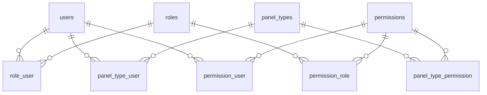
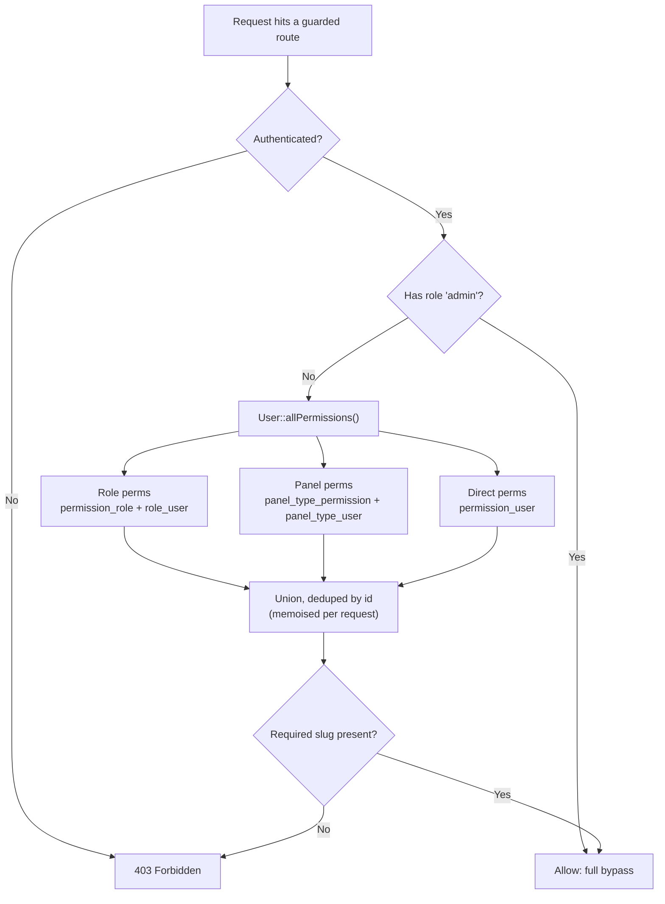

# Permissions & Panels — Flow Guide

How access is granted, resolved and audited in this application.

---

## 1. The model

There are **three ways** a user can be granted a permission:

| Source | Meaning | Pivot table | Managed at |
|---|---|---|---|
| **Role** | What the user *is* — job function (Manager, Dispatcher, Order Taker) | `permission_role` + `role_user` | Roles page |
| **Panel** | The user's **profile** — a reusable permission template | `panel_type_permission` + `panel_type_user` | Panels page |
| **Direct** | A one-off exception for a single user | `permission_user` | User edit form |

A user's effective access is the **union** of all three. Anything not granted is denied.

```
effective = role permissions  ∪  panel permissions  ∪  direct permissions
```

### Why union, and not "the panel overrides everything"

This is the standard every major enterprise system follows, and it is worth being explicit about
because the alternative is tempting and wrong:

- **Deny by default.** A user starts with nothing. Access only ever appears through an explicit grant.
- **Permissions are cumulative; least-restrictive wins.** Microsoft Dynamics 365, SAP (single →
  composite roles) and Odoo (groups) all resolve this way. Salesforce is the closest analogue to what
  we are doing: a **Profile** provides the baseline and **Permission Sets** add to it — they never
  subtract.
- **No grant can take access away.** This is the important property. If a panel could *remove* a
  permission a role granted, then adding a user to a panel could silently break them, and no admin
  could reason about the outcome without simulating the whole graph. Union keeps every grant
  independent and additive, so a change can only ever be read as "this adds X".

Practical consequence: **to reduce someone's access you remove a grant, you do not add a
restriction.**

---

## 2. Data model



Panels mirror roles exactly: `panel_type_permission` is the twin of `permission_role`.

---

## 3. How a request is resolved



Everything funnels through one method — `User::allPermissions()` in
[app/Models/User.php](../app/Models/User.php). That is why adding the panel layer required no changes
to controllers, middleware or Blade views:

- `hasPermission()` / `hasAnyPermission()` / `hasAllPermissions()`
- the `permission:` middleware
- every `@can(...)` in Blade
- the profile page's permission list

all read from it.

### The two enforcement points

| Where | Syntax | Semantics |
|---|---|---|
| Controller constructor | `$this->middleware("permission:edit-panels")->only('update')` | needs **all** listed slugs |
| Route | `->middleware('role_or_permission:admin|editor,view-x|edit-x')` | needs **any** role **or any** permission |
| Blade | `@can('create-panels')` | single slug, via Gate |

---

## 4. Admin workflows

### Create a panel (profile)

1. **Panels → Add Panel**
2. Name it after the job it represents, not the person (`Dispatch Desk`, not `Ali's panel`).
3. Tick the permissions the profile should carry.
4. Save.

Faster path: **clone** the closest existing panel with the copy button and adjust. A new profile is
almost always a variation of one that already exists, and cloning avoids rebuilding a permission set
by hand. Cloning copies permissions but **never users**.

### Onboard a user

1. **Users → Add User**
2. Assign a **role** (job function) and a **panel** (profile).
3. Leave *Direct User Permissions* empty. The form shows a live read-only list of what the selected
   panels grant, so you can see the result before saving.

Direct grants are for genuine exceptions only. They are invisible from the Panels page, so a system
run on direct grants becomes impossible to audit — which defeats the point of having profiles.

### Change what a panel can do

1. **Panels → edit**
2. The modal warns how many users the change will hit. Panel changes take effect on their **next
   request** — there is nothing to re-save per user.
3. Save. The success message confirms the number affected.

### Audit a user ("why can they do this?")

**Users → View Options → Effective Permissions**

One row per permission the user holds, with the source of each: which role, which panel, or a direct
grant. Admins are flagged separately because the `admin` role bypasses every check.

### Offboard / reduce access

Remove the grant that provides it — take the user out of the panel, change their role, or clear the
direct permission. Never try to "block" a permission; there is no deny layer, by design (§1).

### Delete a panel

Only possible once **no users are assigned**. The delete button stays disabled while the panel has
members, and the controller rejects the request too. Deleting a populated profile would silently
strip access from everyone in it, so reassignment has to be a deliberate, visible step.

---

## 5. Audit trail

Model events do not fire on pivot writes, so permission changes would otherwise be invisible in the
activity log. Both sides now log explicitly, via `logCustomActivity()` in
[app/Traits/LogsActivity.php](../app/Traits/LogsActivity.php):

| Action | Logged as | Records |
|---|---|---|
| Panel permissions changed | `PanelType permissions updated` | before → after permission names |
| User role/panel/direct changed | `User access updated` | before → after for all three |

Both render on the **Activity Logs** page as `changed from 'A, B' to 'A, B, C'`, with causer, IP and
timestamp. This is what makes "who granted this access, and when" answerable.

---

## 6. Adding a new permission

1. Add it to the `$permissions` array in
   [database/seeders/PanelRolesSeeder.php](../database/seeders/PanelRolesSeeder.php)
   (`updateOrCreate`, so re-running is safe).
2. `php artisan db:seed --class=PanelRolesSeeder`
3. Guard the code with it — controller middleware, route, or `@can`.
4. Grant it to the roles/panels that need it.

No Gate registration needed: `AppServiceProvider::boot()` defines a Gate for **every** permission
slug in the table at boot, so a new row is immediately usable in `@can`.

---

## 7. Gotchas

- **The `admin` role bypasses everything.** `Gate::before()` in `AppServiceProvider` returns `true`
  for admins, and `PermissionMiddleware` skips its checks for them. Panel and direct grants are
  irrelevant for an admin — don't debug their access through this system.
- **`allPermissions()` is memoised per request.** It is hit by every `@can`, so without the cache a
  page with 20 gates would fire 60 queries. If you sync roles/panels/permissions and then check
  access **in the same request**, call `$user->refreshPermissionCache()` first (the user controller
  already does).
- **Gates are registered from the DB at boot.** A permission that exists in code but not in the
  `permissions` table has no Gate, so `@can('that-slug')` is always false for non-admins.
- **Multiple panels per user are allowed** and their permissions union. If you want to enforce the
  stricter one-profile-per-user rule (as Salesforce does), validate `panel_types` to `max:1` in
  `UserManagementController` — the schema does not need to change.
- **Quote-status permissions are special-cased.** `PermissionMiddleware` additionally reads the
  `?status=` query parameter and checks a matching `view-quotes-{status}` slug. Panel grants feed
  this the same as role grants.
- **Pre-existing inconsistency, unrelated to panels:** `AdminController` guards the activity log with
  `view-activityLogs` (camelCase), but the seeder's list uses no such slug — so no non-admin can
  reach that page. Worth reconciling to `view-activity-logs`.

---

## 8. Deploying this change

```bash
composer install
php artisan migrate                                  # creates panel_type_permission
php artisan db:seed --class=PanelRolesSeeder         # adds view/create/edit/delete-panels
php artisan optimize:clear
```
